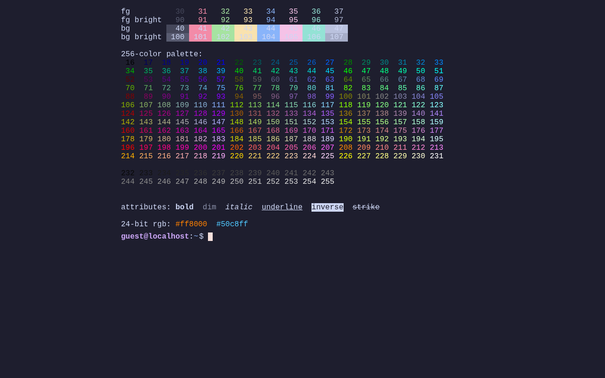
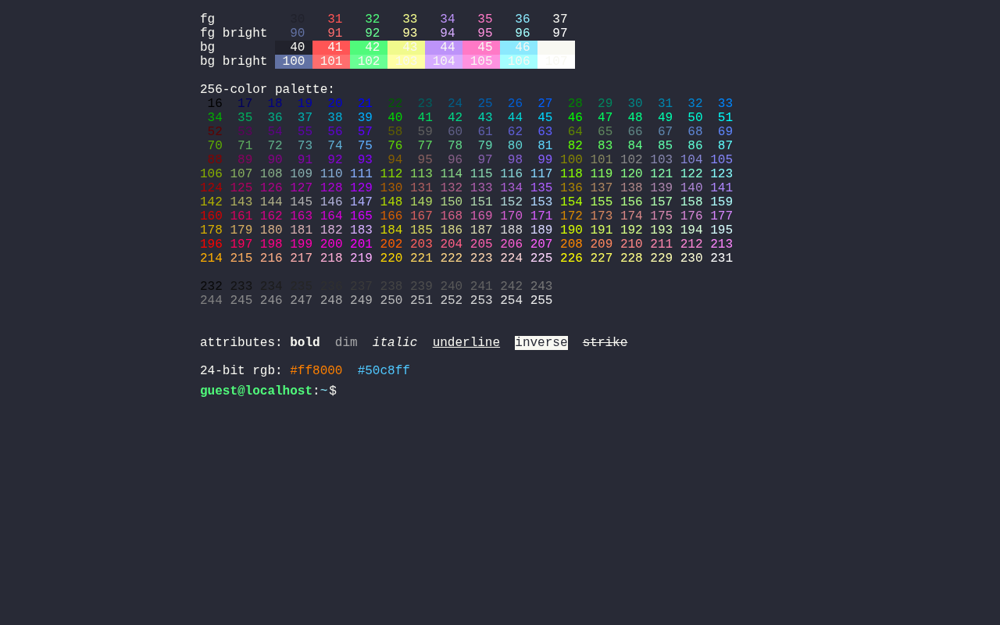
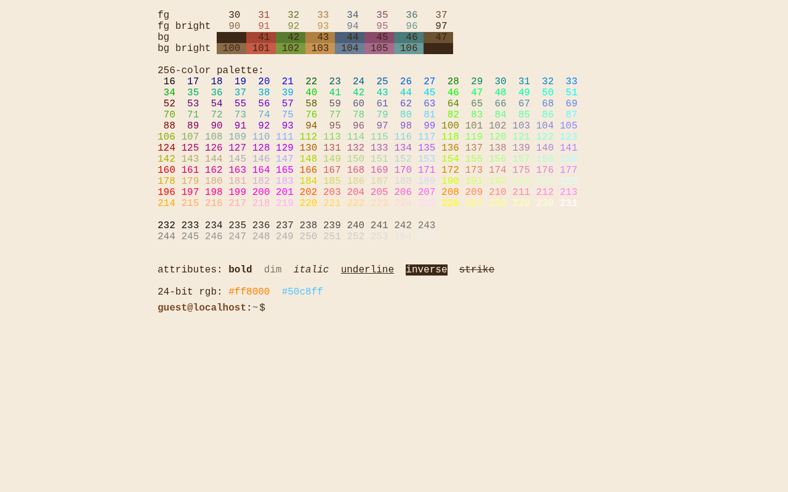
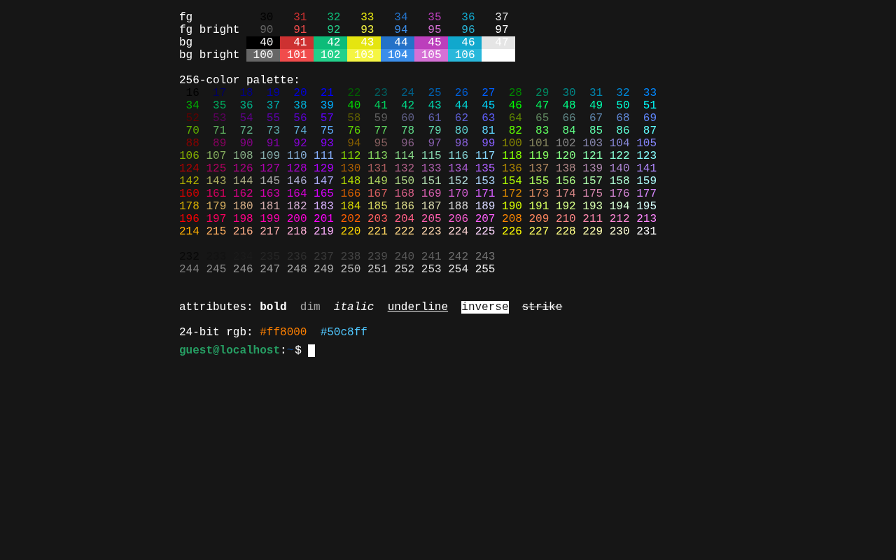
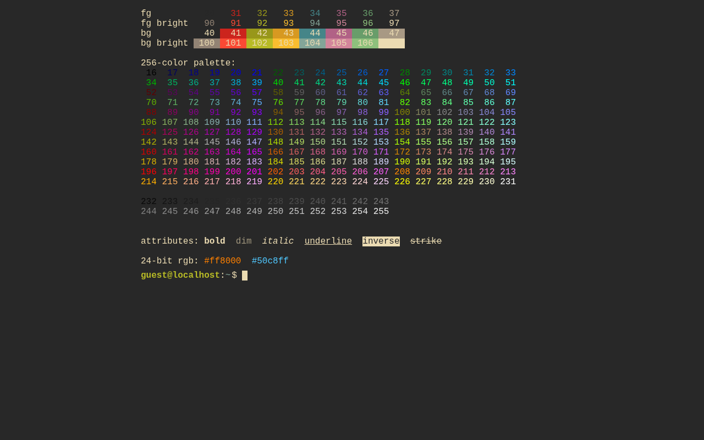
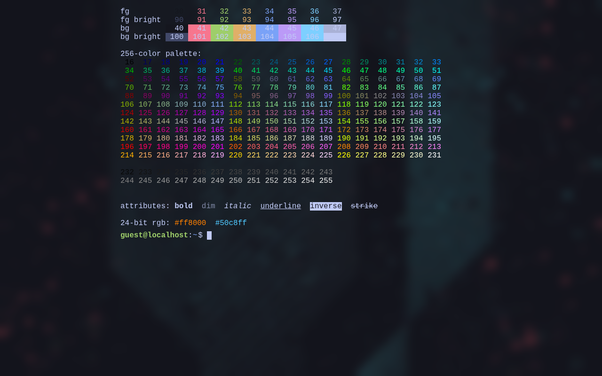
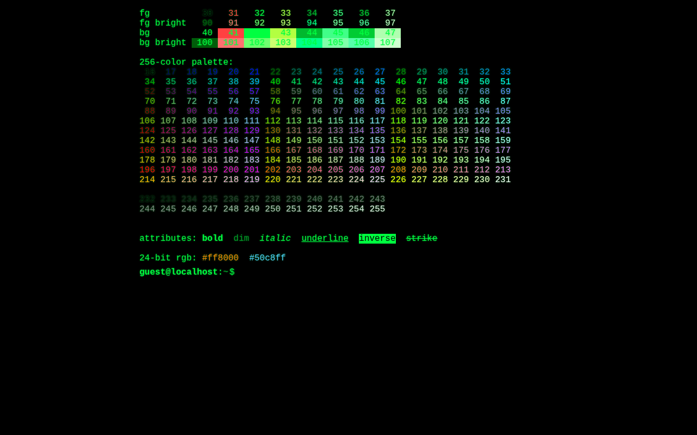
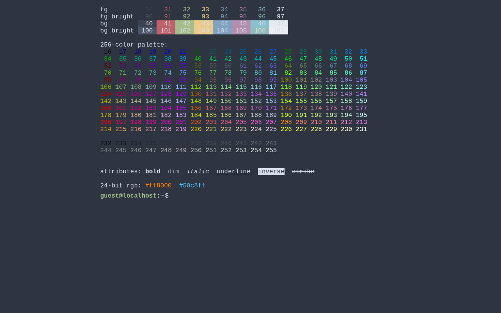
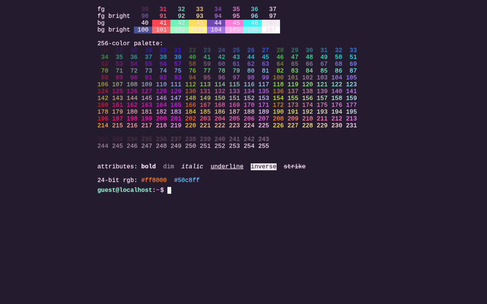
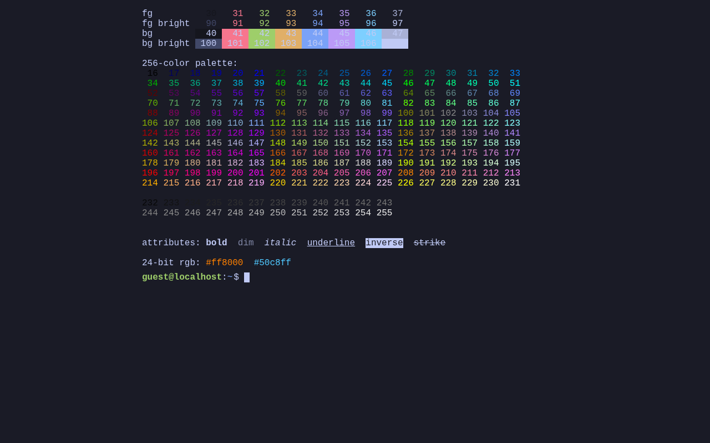

# Shell Website

[](LICENSE)

A static website that looks and feels like a real shell. Your content is served
as commands and files. Everything runs in the browser with static files.


**Demo:** [jpinillos.dev](https://jpinillos.dev). Fork it, fill in the
placeholders in `src/plugins/me/*.ts` and `src/config.ts`.

---

## Contents

- [Features](#features)
- [Quick start](#quick-start)
- [Make it yours](#make-it-yours)
- [Extending](#extending)
- [License](#license)

---

## Features

**Your content, as commands and files**

- Bio + links served as the landing `welcome` command
- Content commands: `about`, `projects` (live GitHub repo list), plus any
  you add
- Content files: `~/about.txt`, `~/contact.txt`
- Markdown-style links (`[text](url)`) render as clickable anchors
- Edit in `src/plugins/me/*.ts` and `src/config.ts`

**Themes**

Framework themes: `catppuccin-mocha`, `crt`, `dracula`, `espresso`, `graphite`,
`gruvbox`, `matrix`, `nord`, `synthwave`, `tokyo-night`. Plus `jazho76` as an example
of a custom theme. Swap at runtime via `theme <name>`. One
module per theme. Update `src/themes/index.ts` to add your own or change the default.

<table>
  <tr>
    <td align="center">
      <a href="docs/themes/catppuccin-mocha.png"></a><br>
      <sub><code>catppuccin-mocha</code></sub>
    </td>
    <td align="center">
      <a href="docs/themes/crt.png"></a><br>
      <sub><code>crt</code></sub>
    </td>
    <td align="center">
      <a href="docs/themes/dracula.png"></a><br>
      <sub><code>dracula</code></sub>
    </td>
  </tr>
  <tr>
    <td align="center">
      <a href="docs/themes/espresso.png"></a><br>
      <sub><code>espresso</code></sub>
    </td>
    <td align="center">
      <a href="docs/themes/graphite.png"></a><br>
      <sub><code>graphite</code></sub>
    </td>
    <td align="center">
      <a href="docs/themes/gruvbox.png"></a><br>
      <sub><code>gruvbox</code></sub>
    </td>
  </tr>
  <tr>
    <td align="center">
      <a href="docs/themes/jazho76.png"></a><br>
      <sub><code>jazho76</code></sub>
    </td>
    <td align="center">
      <a href="docs/themes/matrix.png"></a><br>
      <sub><code>matrix</code></sub>
    </td>
    <td align="center">
      <a href="docs/themes/nord.png"></a><br>
      <sub><code>nord</code></sub>
    </td>
  </tr>
  <tr>
    <td align="center">
      <a href="docs/themes/synthwave.png"></a><br>
      <sub><code>synthwave</code></sub>
    </td>
    <td align="center">
      <a href="docs/themes/tokyo-night.png"></a><br>
      <sub><code>tokyo-night</code></sub>
    </td>
    <td></td>
  </tr>
</table>

Themes are CSS-var overrides plus optional structured props
(`backgroundImage`, `overlayBackground`, `overlayBlur`) for wallpaper / glass
effects, plus arbitrary freeform CSS for one-off effects (see `crt`'s
scanline overlay).

**Built-in commands**

- `ls`, `cd`, `pwd`, `cat`, `echo`, `file`, `help`, `clear`, `exit`, `restart`
- `mkdir`, `touch`, `cp`, `mv`, `rm`
- `grep`, `wc`, `find`
- `whoami`, `id`, `history`
- `uname`, `date`, `who`, `ps`, `kill`
- `theme`, `colortest`, `welcome`, `projects`, `version`, `about`

**Shell**

- Pipelines (`|`), redirection (`>`, `>>`, `<`), chaining (`&&`, `||`, `;`)
- Variable expansion (`$VAR`, `${VAR}`), assignments, environment
- Pathname expansion (`*`, `?`, `[…]`, `~`)
- Quoting (single literal, double with `$` interpolation)
- History persisted to `~/.bash_history` (↑/↓ to walk)
- Tab completion (executables for the first word, paths elsewhere), `Ctrl+L`
  to clear

```bash
ls -la /bin | grep un | wc -l
echo hello > ~/note.txt && cat ~/note.txt
NAME=world; echo "hello, $NAME"
```

**Virtual filesystem**

- Unix-style permissions (owner/group/mode), per-command identity
- Guest vs root users (if user finds how to escalate)
- Mounts: `/proc` and `/dev` are synthetic; `/etc`, `/home`, `/root`, `/usr`,
  `/var` are tree-mounted by dedicated plugins
- `vfs.appendDir(path, children)` lets any plugin contribute files to a tree
  owned by another plugin (strict: path must exist; duplicate names throw)
- `resolve`, `list`, `stat`, `read`, `write`, `mkdir`, `rm`: same contract
  every plugin uses

**ANSI rendering**

- SGR escape parser: basic + bright 16-color, 256-color, 24-bit RGB, bold,
  dim, italic, underline, inverse, strike
- 16-color palette is theme-aware (CSS vars); 256 and RGB are fixed

---

## Quick start

Requires Node 22+.

```bash
npm install
npm run dev          # http://localhost:8080
npm run build        # production bundle → dist/
npm run test:unit    # vitest
npm run test:e2e     # playwright
```

---

## Make it yours

Everything you customize without writing new code lives in these files.
Framework code under `src/core/` and the non-`me/` plugins under
`src/plugins/` stays untouched.

| File                        | What's in it                                               |
| --------------------------- | ---------------------------------------------------------- |
| `src/config.ts`             | GitHub username, PostHog key, hostname override, tab title |
| `src/plugins/me/welcome.ts` | Landing banner + bio + links (the `welcome` command)       |
| `src/plugins/me/about.ts`   | `about.txt` content + `/bin/about`                         |
| `src/plugins/me/contact.ts` | `contact.txt` content + `/bin/contact`                     |
| `src/system.ts`             | Fictional OS / hardware / firmware / kernel identity       |
| `src/themes/index.ts`       | `DEFAULT_THEME` — which theme to boot with                 |

Recommended path:

1. Clone or use as template.
2. Edit `src/config.ts`.
3. Edit each `src/plugins/me/*.ts` — swap in your bio, links, etc.
4. Pick a default theme in `src/themes/index.ts` (`DEFAULT_THEME`).
5. Optional: rebrand `src/system.ts`

---

## Extending

When editing content isn't enough, write a plugin or a theme.

### Architecture

```
src/
├── config.ts                     personal knobs (github user, posthog key, hostname)
├── system.ts                     fictional OS / hardware / firmware / kernel identity
├── core/
│   ├── kernel.ts                 registers plugins, exposes events + executable registry
│   ├── shell.ts                  pipes, redirs, env, argv dispatch; aliasCat helper
│   ├── shell-parser.ts           tokenizer + parser (quotes, |, &&, >, ;)
│   ├── shell-glob.ts             pathname expansion (*, ?, [...])
│   ├── vfs.ts                    in-memory filesystem with mounts, permissions, appendDir
│   ├── terminal.ts               DOM rendering, markup, input handling, history
│   ├── ansi.ts                   SGR escape parser + attrs → CSS
│   └── color.ts                  tiny wrappers: red(s), bold(s), etc.
├── plugins/
│   ├── me/                       your personal plugins (welcome, about, contact)
│   ├── etc.ts, dev.ts, proc.ts   synthetic /etc, /dev, /proc mounts
│   ├── home.ts, root.ts, usr.ts, var.ts  tree mounts for userland dirs
│   ├── coreutils.ts, fsutils.ts, text.ts, find.ts  standard unix utilities
│   ├── sysinfo.ts                uname, who, ps, kill, date, restart
│   ├── identity.ts, pwn.ts       identity, privilege escalation easter egg
│   ├── theme.ts                  theme switching + CSS injection
│   ├── boot-splash.ts            BIOS-style boot sequence
│   ├── bash-history.ts           history replay from VFS
│   ├── projects.ts               live GitHub repo list
│   ├── fortune.ts, colortest.ts, rm-egg.ts, version.ts  misc
│   └── index.ts                  plugin registry + install order
├── themes/                       css-var overrides + optional structured props
├── styles.css                    terminal layout
└── index.html                    entry
```

`src/core/kernel.ts` owns the plugin install loop. Each plugin is a
`PluginInstall` function that receives the kernel and registers executables
(`kernel.installExecutable(...)`) and/or mounts (`kernel.registerMount(...)`).
The shell dispatches by path: `echo hi` walks `$PATH`, finds `/bin/echo`,
invokes its `exec(ctx)`. VFS identity is bound to `ctx.fs` so permission
checks happen transparently; mounts compute nodes on demand via
`Mount.resolve(rel)`.

### Writing a plugin

Minimal example, `src/plugins/hello.ts`:

```ts
import type { PluginInstall } from '../core/kernel.js';

const install: PluginInstall = kernel => {
  kernel.installExecutable('/bin/hello', {
    describe: 'print a friendly greeting',
    exec(ctx) {
      const who = ctx.argv[1] ?? 'world';
      ctx.stdout(`hello, ${who}\n`);
      return 0;
    },
  });
};

export default install;
```

Register in `src/plugins/index.ts`.

The `ctx` argument passed to `exec`:

```ts
{
  argv: string[];           // ["mycmd", "arg1", "arg2"]
  raw: string;              // original command line
  cwd: string;              // current working directory (absolute)
  env: Record<string, string>;
  stdin: string;            // piped input from previous command, or ""
  stdout(s: string): void;  // write to terminal (or next pipe)
  stderr(s: string): void;
  out(s: string): void;     // alias for stdout
  fs: {                     // identity + cwd pre-bound
    resolve, read, list, stat,
    write, mkdir, rm, normalize, displayPath
  };
  term: { clear, toggleClass, corrupt, appendEntry };
  run(cmdline: string): Promise<number>;
  sleep(ms: number): Promise<void>;
}
```

`exec` is sync or async and returns the exit code. Common patterns:

```ts
// Flags
const args = ctx.argv.slice(1);
const flags = new Set(
  args.filter(a => a.startsWith('-')).flatMap(a => [...a.slice(1)])
);

// VFS read/write. Errors use Unix codes (ENOENT, EACCES, EISDIR, …)
const r = ctx.fs.read('/etc/hostname');
if (r.ok) ctx.stdout(r.content);

// Piped input arrives as a string in ctx.stdin
const lines = ctx.stdin.split('\n').filter(Boolean);

// Colors compose. Each helper wraps with its specific turn-off code
ctx.stdout(`${bold(red('error:'))} ${dim('details')}\n`);

// Clickable links via [text](url) markup
ctx.stdout('see [docs](https://example.com)\n');

// Async. stdout streams as you write
const res = await fetch('https://api.example.com/thing');
ctx.stdout(JSON.stringify(await res.json()) + '\n');
```

See `src/plugins/coreutils.ts` (`ls`) for a worked flag-parsing example and
`src/plugins/projects.ts` for a cached fetch.

### Adding files to existing mounts (`vfs.appendDir`)

Root paths like `/home`, `/root`, `/usr`, `/var` are owned by dedicated
plugins (`src/plugins/home.ts` etc.). Other plugins can drop files into
those trees with `vfs.appendDir`:

```ts
import { asGuest, file } from '../core/vfs.js';

const install: PluginInstall = kernel => {
  kernel.vfs.appendDir('/home/guest', {
    'notes.txt': asGuest(file('stuff I want to leave lying around\n')),
  });
};
```

Rules:

- The target path must exist and be a directory at call time (the owning
  plugin must register its mount first; ordering is handled via
  `src/plugins/index.ts`).
- Duplicate filenames at the same path throw — the earlier registration
  wins, loudly.
- Contributions are re-applied after `reboot()` so the tree stays consistent.

`src/plugins/me/about.ts` and `contact.ts` are worked examples.

### Registering a new root mount

The `home.ts` / `root.ts` / `usr.ts` / `var.ts` plugins show the pattern.
Add a new one:

```ts
import type { PluginInstall } from '../core/kernel.js';
import { dir, file, treeMount } from '../core/vfs.js';

const buildMy = () =>
  dir({
    'notes.txt': file('hello from /my\n'),
  });

const install: PluginInstall = kernel => {
  kernel.registerMount(treeMount('/my', buildMy));
};

export default install;
```

Register in `src/plugins/index.ts`. Other plugins can now
`vfs.appendDir('/my', ...)` to extend it.

### Writing a theme

Themes are CSS-var overrides scoped to a `data-theme` attribute, plus a few
optional structured props. Minimum theme, `src/themes/solarized.ts`:

```ts
import type { Theme } from './index.js';

const theme: Theme = {
  name: 'solarized',
  describe: 'solarized dark',
  css: `
body[data-theme="solarized"] {
  --bg: #002b36;
  --fg: #839496;
  --prompt-host: #859900;
  --prompt-cwd: #268bd2;
  --link: #2aa198;
  --cursor-bg: #eee8d5;
  --cursor-fg: #002b36;

  --ansi-0: #073642;  --ansi-1: #dc322f;
  --ansi-2: #859900;  --ansi-3: #b58900;
  --ansi-4: #268bd2;  --ansi-5: #d33682;
  --ansi-6: #2aa198;  --ansi-7: #eee8d5;
  /* …8-15 for the bright variants */
}`,
};
export default theme;
```

Full CSS variable list (from `src/styles.css`): `--bg`, `--fg`,
`--prompt-host`, `--prompt-cwd`, `--link`, `--cursor-bg`, `--cursor-fg`,
`--text-shadow`, `--ansi-0` through `--ansi-15`.

Register in `src/themes/index.ts`. Change `DEFAULT_THEME` there to make a
theme the out-of-box palette.

**Theme props** (optional, composable with the freeform `css`):

```ts
const theme: Theme = {
  name: 'my-glass',
  describe: 'wallpaper + glass',
  backgroundImage: wallpaperUrl, // import from a .jpg/.png
  overlayBackground: 'rgba(26, 27, 38, 0.75)',
  overlayBlur: '10px',
  css: `body[data-theme="my-glass"] { --bg: #1a1b26; --fg: #c0caf5; /* … */ }`,
};
```

`backgroundImage` sets the body background. `overlayBackground` and
`overlayBlur` render a full-viewport pseudo-element with backdrop-blur on
top, giving a glassmorphism effect. See `src/themes/jazho76.ts` for a full
example. One-off effects (scanlines, animations) live in the freeform `css`
string — see `src/themes/crt.ts`.

### ANSI + color helpers

Anything written via `ctx.stdout` passes through `parseAnsi` before hitting
the DOM. Emit raw SGR sequences or use the helpers in `src/core/color.ts`:

```ts
import {
  black,
  red,
  green,
  yellow,
  blue,
  magenta,
  cyan,
  white,
  brightRed,
  brightGreen,
  brightYellow,
  brightBlue,
  brightMagenta,
  brightCyan,
  bgRed,
  bold,
  dim,
  italic,
  underline,
  inverse,
  strike,
} from '../core/color.js';

red('a' + bold('b') + 'c'); // a and c red, b red + bold
```

Each helper is `(s: string) => string` and closes with its specific turn-off
code (39 for fg, 22 for bold, …), so nested calls compose. Supports basic +
bright 16-color fg/bg, 256-color (`\x1b[38;5;N]m`), 24-bit RGB
(`\x1b[38;2;R;G;B]m`), and attribute on/off pairs. Non-SGR CSI sequences are
silently swallowed. The 16-color indices map to `--ansi-0..15` CSS vars, so
they track the active theme; 256/RGB are fixed.

---

## License

This project is MIT licensed, see [LICENSE](LICENSE). Fork it, ship it, do
what you want.

Bundled third-party color palettes are credited in
[THIRD_PARTY_NOTICES.md](THIRD_PARTY_NOTICES.md).
