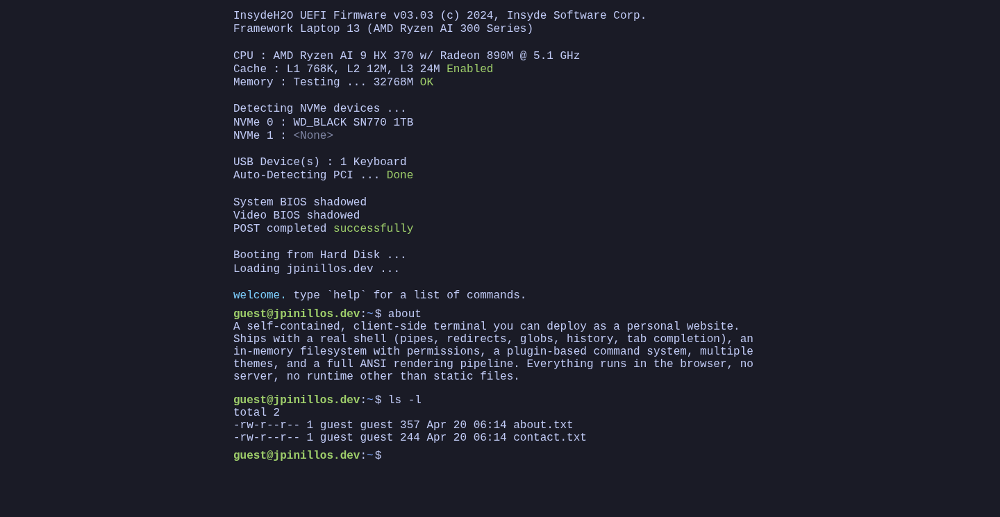

# Shell Website

A self-contained, client-side terminal you can deploy as a personal website.
Ships with a real shell (pipes, redirects, globs, history, tab completion), an
in-memory filesystem with permissions, a plugin-based command system, multiple
themes, and a full ANSI rendering pipeline. Everything runs in the browser, no
server, no runtime other than static files.

**Demo:** [jpinillos.dev](https://jpinillos.dev). Fork it, strip my content,
drop in yours.



---

## Contents

- [Features](#features)
- [Quick start](#quick-start)
- [Make it yours](#make-it-yours)
- [Extending](#extending)
- [License](#license)

---

## Features

**Shell**

- Pipelines (`|`), redirection (`>`, `>>`, `<`), chaining (`&&`, `||`, `;`)
- Variable expansion (`$VAR`, `${VAR}`), assignments, environment
- Pathname expansion (`*`, `?`, `[…]`, `~`)
- Quoting (single literal, double with `$` interpolation)
- History persisted to `~/.bash_history` (↑/↓ to walk)
- Tab completion (executables for the first word, paths elsewhere), `Ctrl+L`
  to clear

```bash
ls /bin | grep sh | wc -l
echo hello > ~/note.txt && cat ~/note.txt
NAME=joaquin; echo "hello, $NAME"
```

**Virtual filesystem**

- Unix-style permissions (owner/group/mode), per-command identity
- Guest vs root users with privilege drop/switch (`su`, `sudo`)
- Mount abstraction: `/proc` and `/dev` are synthetic, `/etc` is a tree; plug
  your own by implementing `Mount` and calling `kernel.vfs.registerMount(m)`
- `resolve`, `list`, `stat`, `read`, `write`, `mkdir`, `rm`: same contract
  every plugin uses

**Built-in commands**

- `ls`, `cd`, `pwd`, `cat`, `echo`, `file`, `help`, `clear`, `exit`, `restart`
- `mkdir`, `touch`, `cp`, `mv`, `rm`
- `grep`, `sort`, `head`, `tail`, `wc`, `uniq`, `cut`, `find`
- `whoami`, `id`, `su`, `sudo`, `history`
- `uname`, `date`, `who`, `ps`, `kill`
- `theme`, `colortest`, `welcome`, `projects`, `version`

`restart` triggers a BIOS-style boot splash.

**ANSI rendering**

- SGR escape parser: basic + bright 16-color, 256-color, 24-bit RGB, bold,
  dim, italic, underline, inverse, strike
- 16-color palette is theme-aware (CSS vars); 256 and RGB are fixed

**Themes**

Ships with `cappuccino`, `crt`, `dracula`, `graphite`, `gruvbox`, `matrix`,
`nord`, `synthwave`, `tokyo-night` (default). Swap at runtime via
`theme <name>`. One module per theme.

---

## Quick start

Requires Node 22+.

```bash
npm install
npm run dev          # http://localhost:8080
npm run build        # production bundle → dist/
npm run preview      # serve the build
npm run lint         # eslint .
npm run format       # prettier . --write
npm run test:unit    # vitest
npm run test:e2e     # playwright
```

Config lives in `.env` (see `.env.example`). The app runs with no env vars
set — analytics just no-op.

---

## Make it yours

To turn this into _your_ site, touch these files. Everything else is the
framework.

| File                           | What's in it                                               |
| ------------------------------ | ---------------------------------------------------------- |
| `src/plugins/welcome.ts`       | Banner + bio + links (the landing command)                 |
| `src/plugins/site-content.ts`  | Personal content, home tree                                |
| `src/plugins/projects.ts`      | `GITHUB_USER` constant for the live GitHub list            |
| `src/plugins/etc.ts`           | `/etc/hostname` value (shows in the prompt)                |
| `src/plugins/identity.ts`      | Default user name (`guest`), root password, etc.           |
| `src/plugins/posthog.ts`       | Reads `VITE_POSTHOG_KEY`; unset it or remove the plugin to disable analytics |
| `src/index.html`               | `<title>`, hardcoded prompt text, favicon                  |
| `public/favicon.png`           | Favicon                                                    |
| `src/themes/`                  | Add your own theme or tweak the defaults                   |
| `.firebaserc`, `firebase.json` | Firebase Hosting config. Update with your project if you deploy there, or delete them if you deploy elsewhere |

Recommended path:

1. Clone, `npm install`, `npm run dev`.
2. Edit `welcome.ts`, `site-content.ts`, `projects.ts` (set `GITHUB_USER`).
3. Edit `etc.ts` to change the hostname.
4. Set `VITE_POSTHOG_KEY` in `.env` to enable analytics, or remove the plugin
   from `src/plugins/index.ts` if you don't want it at all.
5. Pick a host. For Firebase, update `.firebaserc` and add a `FIREBASE_TOKEN`
   secret to GitHub Actions. For anything else, delete the Firebase files and
   wire up your own deploy.
6. Add a plugin for any bespoke command you want (see [Extending](#extending)).

---

## Extending

### Architecture

```
src/
├── core/
│   ├── kernel.ts         registers plugins, exposes events + executable registry
│   ├── shell.ts          pipes, redirs, env, argv dispatch
│   ├── shell-parser.ts   tokenizer + parser (quotes, |, &&, >, ;)
│   ├── shell-glob.ts     pathname expansion (*, ?, [...])
│   ├── vfs.ts            in-memory filesystem with mounts, permissions
│   ├── terminal.ts       DOM rendering, markup, input handling, history
│   ├── ansi.ts           SGR escape parser + attrs → CSS
│   └── color.ts          tiny wrappers: red(s), bold(s), etc.
├── plugins/              one file per feature, each registers executables
├── themes/               css-var overrides, registered like plugins
└── styles.css            :root vars, terminal layout
```

`src/core/kernel.ts` is the only thing that knows about plugins. Each plugin
is a `PluginInstall` function that receives the kernel and calls
`kernel.installExecutable("/bin/<name>", { describe, exec })`. The shell
dispatches by path: `echo hi` walks `$PATH`, finds `/bin/echo`, invokes its
`exec(ctx)`. VFS identity is bound to `ctx.fs` so permission checks happen
transparently; mounts (`/proc`, `/dev`, `/etc`) compute nodes on demand via
`Mount.resolve(rel)`.

### Writing a plugin

Minimal example, `src/plugins/hello.ts`:

```ts
import type { PluginInstall } from '../core/kernel.js';

const install: PluginInstall = kernel => {
  kernel.installExecutable('/bin/hello', {
    describe: 'print a friendly greeting',
    exec(ctx) {
      const who = ctx.argv[1] ?? 'world';
      ctx.stdout(`hello, ${who}\n`);
      return 0;
    },
  });
};

export default install;
```

Register in `src/plugins/index.ts`:

```ts
import hello from './hello.js';
// …add `hello` to the existing `plugins` array export.
```

The `ctx` argument passed to `exec`:

```ts
{
  argv: string[];           // ["mycmd", "arg1", "arg2"]
  raw: string;              // original command line
  cwd: string;              // current working directory (absolute)
  env: Record<string, string>;
  stdin: string;            // piped input from previous command, or ""
  stdout(s: string): void;  // write to terminal (or next pipe)
  stderr(s: string): void;
  out(s: string): void;     // alias for stdout
  fs: {                     // identity + cwd pre-bound
    resolve, read, list, stat,
    write, mkdir, rm, normalize, displayPath
  };
  term: { clear, toggleClass, corrupt };
}
```

`exec` is sync or async and returns the exit code. Common patterns:

```ts
// Flags
const args = ctx.argv.slice(1);
const flags = new Set(
  args.filter(a => a.startsWith('-')).flatMap(a => [...a.slice(1)])
);

// VFS read/write. Errors use Unix codes (ENOENT, EACCES, EISDIR, …)
const r = ctx.fs.read('/etc/hostname');
if (r.ok) ctx.stdout(r.content);

// Piped input arrives as a string in ctx.stdin
const lines = ctx.stdin.split('\n').filter(Boolean);

// Colors compose. Each helper wraps with its specific turn-off code
ctx.stdout(`${bold(red('error:'))} ${dim('details')}\n`);

// Clickable links via [text](url) markup
ctx.stdout('see [docs](https://example.com)\n');

// Async. stdout streams as you write
const res = await fetch('https://api.example.com/thing');
ctx.stdout(JSON.stringify(await res.json()) + '\n');
```

See `src/plugins/coreutils.ts` (`ls`) for a worked flag-parsing example and
`src/plugins/projects.ts` for a cached fetch.

### Writing a theme

Themes are CSS-var overrides scoped to a `data-theme` attribute.
`src/themes/solarized.ts`:

```ts
import type { Theme } from './index.js';

const theme: Theme = {
  name: 'solarized',
  describe: 'solarized dark',
  css: `
body[data-theme="solarized"] {
  --bg: #002b36;
  --fg: #839496;
  --prompt-host: #859900;
  --prompt-cwd: #268bd2;
  --link: #2aa198;
  --cursor-bg: #eee8d5;
  --cursor-fg: #002b36;

  --ansi-0: #073642;  --ansi-1: #dc322f;
  --ansi-2: #859900;  --ansi-3: #b58900;
  --ansi-4: #268bd2;  --ansi-5: #d33682;
  --ansi-6: #2aa198;  --ansi-7: #eee8d5;
  /* …8-15 for the bright variants */
}`,
};
export default theme;
```

Register in `src/themes/index.ts`. Change `DEFAULT_THEME` to make it the
out-of-box palette. Full variable list: see `:root` in `src/styles.css`.

### ANSI + color helpers

Anything written via `ctx.stdout` passes through `parseAnsi` before hitting
the DOM. Emit raw SGR sequences or use the helpers in `src/core/color.ts`:

```ts
import {
  black,
  red,
  green,
  yellow,
  blue,
  magenta,
  cyan,
  white,
  brightRed,
  brightGreen,
  brightYellow,
  brightBlue,
  brightMagenta,
  brightCyan,
  bgRed,
  bold,
  dim,
  italic,
  underline,
  inverse,
  strike,
} from '../core/color.js';

red('a' + bold('b') + 'c'); // a and c red, b red + bold
```

Each helper is `(s: string) => string` and closes with its specific turn-off
code (39 for fg, 22 for bold, …), so nested calls compose. Supports basic +
bright 16-color fg/bg, 256-color (`\x1b[38;5;N]m`), 24-bit RGB
(`\x1b[38;2;R;G;B]m`), and attribute on/off pairs. Non-SGR CSI sequences are
silently swallowed. The 16-color indices map to `--ansi-0..15` CSS vars, so
they track the active theme; 256/RGB are fixed.

---

## License

The framework is MIT licensed, see [LICENSE](LICENSE). Fork it, ship it, do
what you want.

The content in `src/plugins/welcome.ts`, `src/plugins/site-content.ts`, and
`src/plugins/projects.ts` (bio, links, copy) is mine. Legally the MIT license
covers it too, but socially please rip it out and put your own in before
deploying.
